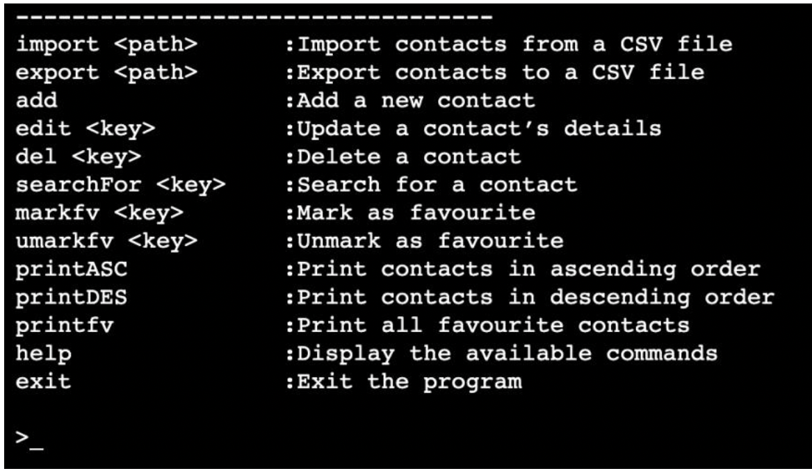
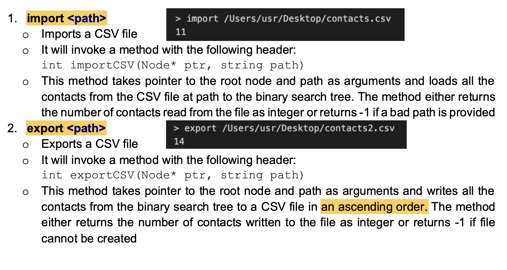
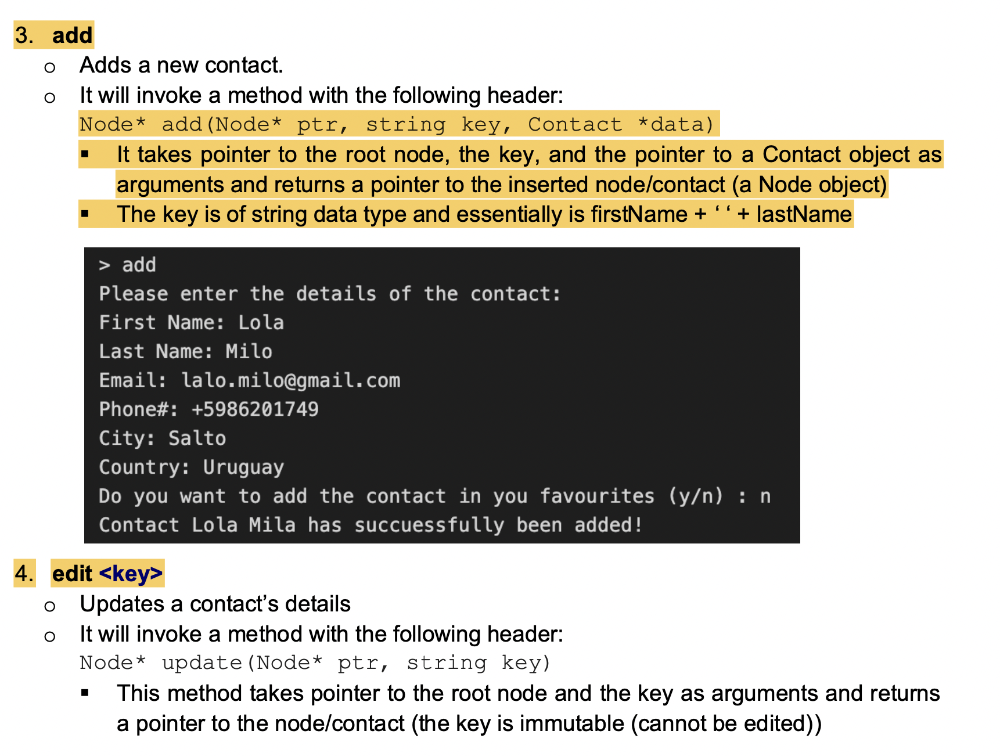
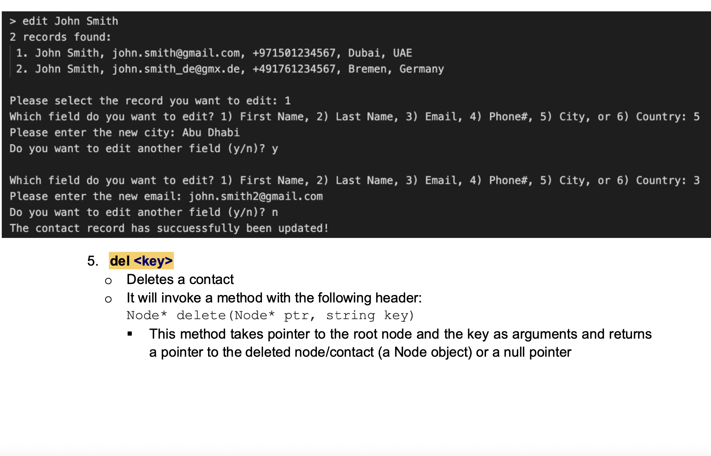
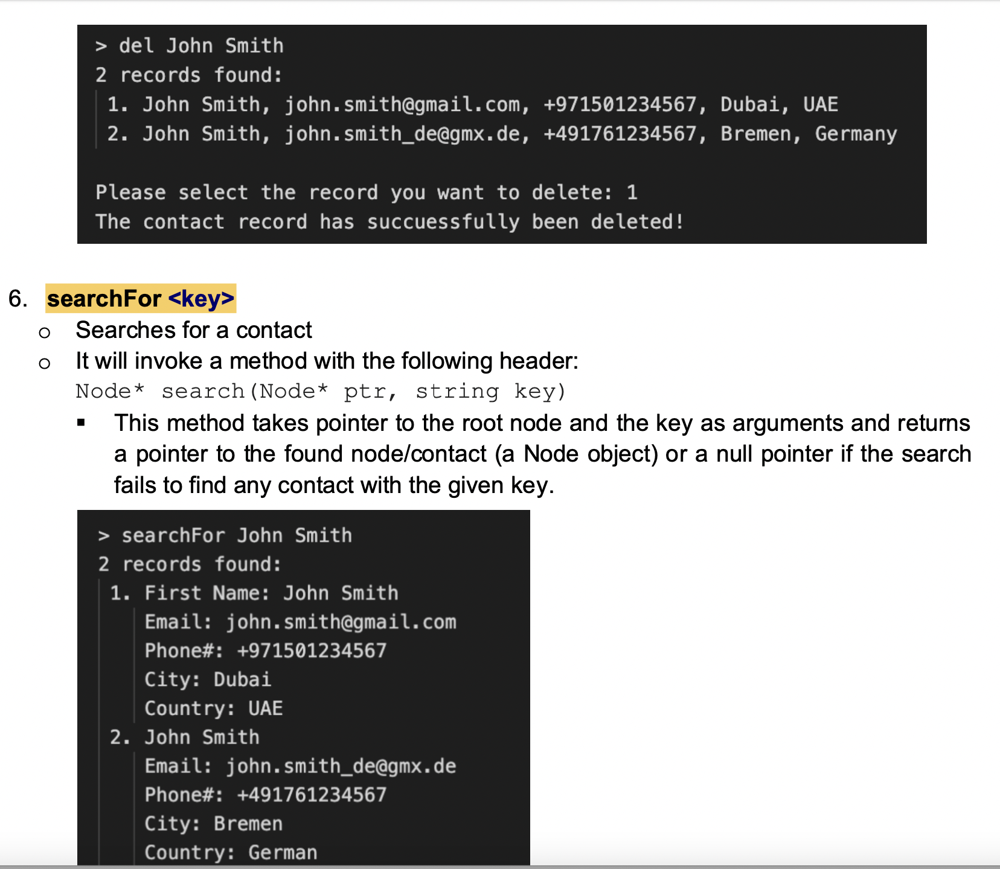
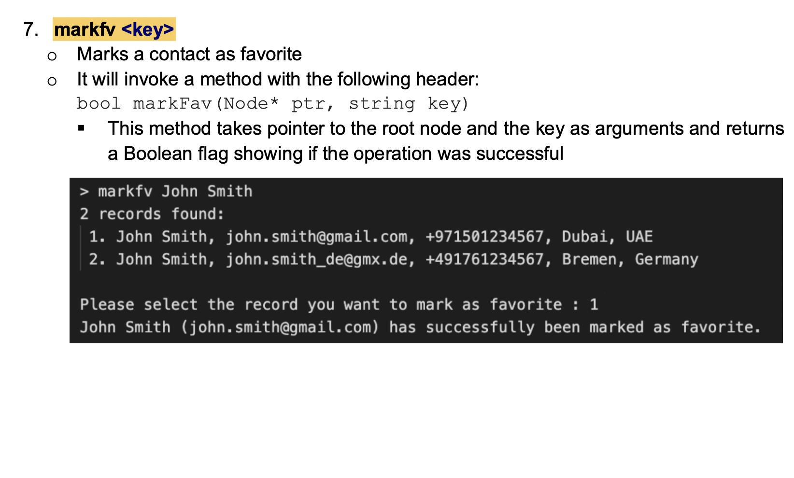
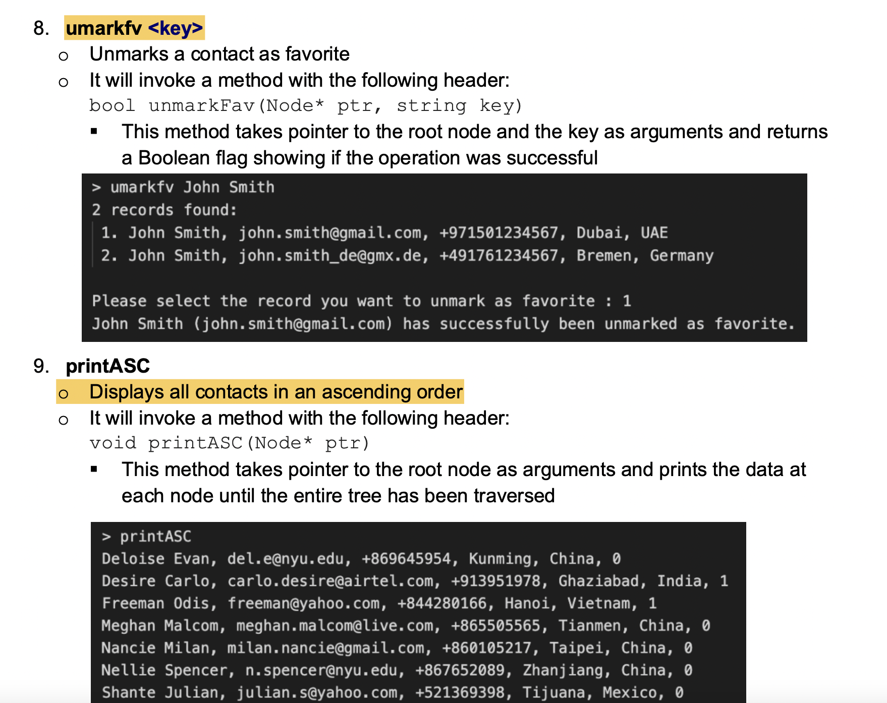

# Contact-Management-System

The application stores the contact’s attributes, such as first name, last name, phone number, email address, city, country, and a flag showing whether a contact is among favorite contacts or not. The application will be able to import/ export the contacts into a comma separated (CSV) file. The user interface should allow a user to navigate and perform the tasks/features listed in the following section.

## Implementation

CSV File Format:
The details of each contact in order are:
First name, last name, email address, phone, city, country, isFavorite
Ex.: Amal, Obeid, amal.obeid@gmail.com, +971506177234, Al Ain, UAE, 1 Storing the contact details will generate a file similar to the following:

contacts.csv
Meghan, Malcom, meghan.malcom@live.com, +865505565, Tianmen, China, 0 
Shante, Julian, julian.s@yahoo.com, +521369398, Tijuana, Mexico, 0
Suk, Cornelius, cornelius@gmail.com, +918078552, Bangalore, India, 0 
Desire, Carlo, carlo.desire@airtel.com, +913951978, Ghaziabad, India, 1 
Tamica, Jeremiah, tamica@gmail.com, +814017766, Sapporo, Japan, 1
Nellie, Spencer, n.spencer@nyu.edu, +867652089, Zhanjiang, China, 0 
Deloise, Evan, del.e@nyu.edu, +869645954, Kunming, China, 0 
Wendolyn, Drew, drew@gmail.com, +553847549, Curitiba, Brazil, 1 
Freeman, Odis, freeman@yahoo.com, +844280166, Hanoi, Vietnam, 1 
Teena, Emerson, teena@gmail.com, +919636770, Agra, India, 1 
Nancie, Milan, milan.nancie@gmail.com, +860105217, Taipei, China, 0

Constraints:
- First name + last name (separated by a space) will serve as a key. For instance, the first name, “John” and the last name “Smith”, form the key “John Smith”.
- Every BST node stores a vector of contact objects. This will allow to have multiple contacts with the same first and last name (i.e., the same key).

## User Interface:
The application will interact with the user using a command line (terminal based) interface as shown below:

